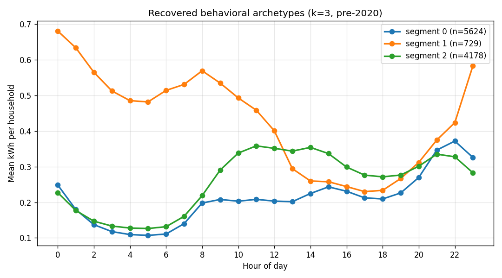

# GoiEner Short-Term Load Forecasting

**Recursive single-step LightGBM with five quantiles, refit-on-full early stopping, and split conformal calibration with interleaved cal/test indices. Walk-forward over 105 weekly folds on a 16,764-household Spanish residential portfolio. Honest reporting of where the model wins and where it loses.**

<p align="center">
  
</p>

[](https://www.python.org/)
[](LICENSE)
[](https://goiener-load-forecasting.streamlit.app)

## What this is

The operationally relevant target for a residential energy retailer is the **portfolio aggregate** — the sum of all customers' hourly consumption. Bulk procurement happens against the aggregate; imbalance settlement is computed against it. Forecasting per-customer is unnecessary for procurement and infeasible at scale. The question is whether forecasting subgroups (behavioural clusters) and reconciling to the aggregate beats forecasting the portfolio directly. **This project evaluates that trade-off explicitly and lands on portfolio-only**, with the residual segmentation contribution kept as an independent commercial-side artefact rather than a forecasting input.

## Two architecturally independent products

| Pipeline | Purpose | Headline result |
|---|---|---|
| **Pipeline 1** — portfolio forecasting | Nightly 168h forecast trajectory with five quantiles, conformal-calibrated bands | MAPE 4.88% at h≤24, +29.6% lift over weekly persistence; conformal gate satisfied across all three pool buckets |
| **Pipeline 2** — behavioural segmentation | k=3 k-means on standardised pre-2020 daily profiles, three operational archetypes for tariff design and demand-response targeting | 10,531 households partitioned; silhouette < 0.20 — operational tags, not statistical discoveries |

Pipeline 2 does **not** feed Pipeline 1. They share the data ingestion and nothing else. The hierarchical-forecasting alternative (subgroup forecasts + MinT-OLS reconciliation) was implemented and discarded; see *Architecture choices* below.

## Forecast accuracy by horizon

Walk-forward over 102 evaluable folds (5 quantiles × 102 = 510 booster fits), against weekly persistence and SARIMAX baselines:

| Horizon | n | Persistence MAPE | SARIMAX MAPE | LightGBM MAPE | Lift vs persistence |
|---|---:|---:|---:|---:|---:|
| h = 1 | 102 | 5.23% | 16.83% | **3.58%** | **+31.6%** |
| h ≤ 24 | 2,448 | 6.93% | 13.38% | **4.88%** | **+29.6%** |
| h = 25–72 | 4,896 | 6.29% | 17.44% | **5.20%** | **+17.3%** |
| h = 73–168 | 9,768 | 7.11% | 23.11% | **6.26%** | **+12.0%** |
| h = 72 | 102 | **4.37%** | 13.69% | 5.46% | **−25.0%** |
| h = 168 | 101 | **5.25%** | 16.79% | 6.95% | **−32.4%** |

### The model loses at h = 72 and h = 168, and that is the interesting result

A recursive single-step model predicts ŷ_{t+1}, feeds that median back into the lag-1 slot, and rolls forward. By h = 72 the median forecast has been folded back 71 times; by h = 168, 167 times. The error compounds. **Weekly persistence (ŷ_t = y_{t-168}) — which simply copies the value from one week earlier — beats the LightGBM at these horizons** because residential consumption is highly periodic at the weekly scale. This is a structural property of recursive inference, not a hyperparameter pathology. A direct multi-horizon model (one booster per h, 7× to 168× more models depending on granularity) would address it. We did not implement it; it's the natural next iteration. **Reporting this loss openly is the point** — most portfolio-forecasting papers truncate at h ≤ 24 to avoid it.

## Conformal calibration with interleaved cal/test indices

Raw recursive bands undercover heavily: cov_50 drops to 0.18 at h = 25–72 and to 0.18 at h = 73–168 against the nominal 0.50; cov_90 compresses to 0.46–0.55 against nominal 0.90. The cause is structural — the median fed back as a lag autosmooths the trajectory, so the bands are too narrow. **Retraining the recursive architecture cannot fix this; we correct it post-hoc with split conformal prediction.**

For each non-median quantile q ∈ {0.05, 0.25, 0.75, 0.95} and each pool bucket (h ≤ 24, h = 25–72, h = 73–168), an offset δ(bucket, q) is estimated on calibration and added to the raw quantile at test time. The median is left untouched, so MAPE is preserved by construction.

Two non-trivial choices:

**Interleaved cal/test split by index parity, not temporal.** The validation window straddles the June 2021 2.0TD tariff reform — a real regime shift in residential consumption. A standard chronological split would put pre-reform issues entirely in calibration and post-reform entirely in test, **breaking the exchangeability assumption that conformal prediction relies on**. Even-index → calibration, odd-index → test distributes the regime shift evenly across the two halves and restores approximate exchangeability without sacrificing data.

**Horizon-bucket pooling.** A per-horizon adjustment on ~51 calibration issues is too noisy at the tails (the empirical 0.05 quantile of 51 samples is essentially the third-smallest residual). Pooling across horizons within three buckets lifts the per-(bucket, q) calibration sample to 1,224 / 2,448 / 4,872. The trade-off — losing per-horizon resolution — is consistent with how the gate is defined (bucket-level coverage in [0.45, 0.55] for cov_50 and [0.85, 0.95] for cov_90).

### Post-conformal coverage

| Bucket | Raw cov_50 | Calibrated cov_50 | Raw cov_90 | Calibrated cov_90 |
|---|---:|---:|---:|---:|
| h ≤ 24 | 0.219 | **0.475** | 0.546 | **0.899** |
| h = 25–72 | 0.184 | **0.490** | 0.475 | **0.878** |
| h = 73–168 | 0.177 | **0.482** | 0.463 | **0.883** |

All three buckets pass the gate post-calibration. Within-pool drift at single horizons is by design (h = 168 cal cov_90 = 0.82 is the deepest case) and reported in the dashboard for visibility, not gated.

## Architecture choices, all explicit

**Recursive single-step, not direct multi-step.** Pro: one model per (level, quantile), simple nightly retraining, natural fit for daily batch generation. Con: documented above. Hybrid (recursive short, direct long) is the next iteration if h > 72 matters operationally.

**Portfolio-only, not segment-then-reconcile.** Per-segment forecasting + MinT-OLS / BottomUp reconciliation (Nixtla `hierarchicalforecast`) was implemented and dropped after the **May 2026 reframe**. Two empirical reasons: (i) the recursive single-step architecture cannot exploit segment heterogeneity at long horizons — over 168 steps the segment trajectories drift toward the mean because the median is fed back as a lag; (ii) pinball loss on extreme quantiles (q = 0.05, q = 0.95) for small segments is dominated by tail noise on a 30-day validation window, producing premature early stopping. **MinT-OLS yielded marginal improvement at h = 25–72 (~0.4 pp) but degraded at h ≤ 24 and h = 168**, so the complexity didn't pay. Archived in [`code/_archive/`](code/_archive/) with a written rejection rationale.

**Early stopping with refit-on-full (Phase 1 + Phase 2).** Phase 1 runs early stopping on a 30-day temporal hold-out with patience = 100 and a 2,500-iteration ceiling; returns best_iteration K. Phase 2 retrains a fresh booster on the entire 365-day window (training + the 30-day hold-out) for exactly K rounds, no validation, no callbacks. **Recovers the 30 days sacrificed to early stopping while preserving the iteration count selected by honest validation.** The information that determined K is discarded after Phase 1 by construction.

**Patience raised to 100 (LightGBM default is 50).** The previous version exhibited 8.9% of fits stopping under 100 iterations on quantile-tail losses dominated by validation-window noise. Patience = 100 reduces but does not eliminate this. Across the 510 walk-forward fits the median best_iteration is 375, the 90th percentile is 2,152, 3.1% hit the 2,500-iteration ceiling, and 8.6% stop under 100 iterations (concentrated at q = 0.05 / q = 0.95). The residual cause is irreducible validation-window noise, not insufficient patience.

**Champion / challenger, not always-deploy.** A challenger is trained nightly on the most recent data and evaluated against the champion on the same rolling 30-day holdout. **Promotion requires three gates simultaneously**: mean MAPE improves by at least PROMOTION_THRESHOLD_MAPE_PP, cov_50 stays above a defensive floor (~0.45), and cov_90 stays at or above its configured threshold. Promotion decisions logged to `logs/promotions.jsonl` for audit; rejected challengers archived with a JSON record of why.

**Causality invariant asserted at every fit, verified across folds.** Phase-2 max timestamp ≥ 2h before the fold's issue time, across all 105 folds. Every feature is row-local: at row t the value depends only on inputs at t or at t − N for fixed N ≥ 1. No EWMA, no centred rolling, no global-stat normalisation, no global-frequency encoding. Rolling means use `pandas.shift(1).rolling(N).mean()` so the window never includes y_t.

## Pipeline 2 — three behavioural archetypes for tariff design

k-means with k = 3 on standardised pre-2020 daily profiles (10,531 households):

| Archetype | Households | % of kWh | Mean kWh/hh/yr | Peak hour | Operational reading |
|---|---:|---:|---:|---:|---|
| **evening-peak** | 5,624 (53.4%) | 46.4% | 3,966 | 22:00 | Target population for time-of-use tariffs that incentivise off-peak shifting |
| **high-baseload** | 729 (6.9%) | 12.3% | 8,128 | 00:00 | Highest revenue per customer (1.78× portfolio mean) — retention / premium service |
| **midday-active** | 4,178 (39.7%) | 41.3% | 4,747 | 11:00 | Load profile matches PV self-consumption — solar-bundle commercial target |

**Silhouette < 0.20 across all k tested.** Different metrics give different optima (silhouette peaks at k = 3, Davies-Bouldin at k = 6, Calinski-Harabasz at k = 2). The elbow plot inflects most sharply between k = 2 and k = 3 (inertia drop −13,003, against −9,197 from k = 3 to k = 4). **k = 3 is the metric-supported and operationally interpretable choice, not a statistical discovery of natural clusters.** Residential daily load shape is a continuum, not a small set of natural archetypes. The labels (evening-peak / high-baseload / midday-active) are operational tags assigned via a two-tier heuristic on the standardised centroids; the silhouette caveat is prominent everywhere these archetypes are reported.

## Limitations, honest

- **Recursive error compounding at h ≥ 72.** Documented above. Direct or hybrid architecture is the next iteration; not implemented.
- **Pinball-loss noise on extreme quantiles.** 8.6% of fits stop under 100 iters. Paths forward: 60/90-day validation window (sacrifices recent training data) or proper Bayesian iteration prior calibrated on prior folds. Out of scope here; documented for revisit.
- **Realized weather, not forecast weather.** Feature-importance aggregation attributes 20.5% of total LightGBM gain to the weather block. **The reported MAPE overstates deployed accuracy by an amount that grows with weather contribution.** Production deployment would consume AEMET / ENTSO-E forecast weather and propagate its error; the gap is non-trivial.
- **Iteration ceiling hit by 3.1% of fits.** Margin is tight; raising the ceiling to 3,000–3,500 would clear these at the cost of compute.
- **Pipeline 2 silhouette < 0.20.** Archetypes are operational tags, not statistically discrete clusters. The clustering structure is a continuum.

## Reproducing

```bash
pip install -r requirements.txt

# Synthetic 50-household sample for end-to-end pipeline validation:
GOIENER_DATA_MODE=sample python code/01_build_panel.py
GOIENER_DATA_MODE=sample python code/03_feature_engineering.py
GOIENER_DATA_MODE=sample python code/05_train_lightgbm.py

# Full run (requires Zenodo dataset, ~2 GB, ~30 min for panel rebuild):
python code/00_download_weather.py
python code/01_build_panel.py
python code/02_segment_households.py
python code/03_feature_engineering.py
python code/04_train_baseline.py
python code/05_train_lightgbm.py
python code/06_walk_forward_validation.py
python code/06b_conformal_calibration.py
python code/08_run_daily_batch.py
python code/09_evaluate_challenger.py
python code/10_summarize_results.py

# Audit the temporal split invariant across all 105 folds:
python code/_verify_no_leakage.py

# Launch dashboard:
streamlit run app/streamlit_app.py
```

## Repository structure

```
code/                            Numbered pipeline scripts (00 → 10)
  _archive/                      Discarded MinT-OLS / BottomUp reconciliation (audit trail)
  _verify_no_leakage.py          Asserts temporal-split invariant across 105 folds
docs/methodology.md              Implementation-level decisions
paper/                           LaTeX source + compiled PDF
models/champion/                 Five-quantile booster suite, current deployment
models/challengers/              Rejected challengers with JSON rejection rationale
output/                          Walk-forward metrics, calibration tables, segment profiles
logs/                            Structured JSON logs (daily batch, promotions)
app/                             Streamlit dashboard
```

## Data

GoiEner smart-meter dataset ([Zenodo DOI 10.5281/zenodo.7362094](https://doi.org/10.5281/zenodo.7362094), Quesada et al. 2024). Hourly residential consumption, 16,764 supply points after CNAE-2009 filter, 10,531 retain a usable pre-2020 daily profile after data-quality filtering. Spans 2014-11-01 through 2022-06-30. Validation window 2020-06-22 to 2022-06-30 (post-COVID-lockdown, straddling the 2021-06-01 2.0TD tariff reform — intentional, see *Conformal calibration*).

## More

- **Paper (PDF)**: [`paper/load_forecasting_paper.pdf`](paper/load_forecasting_paper.pdf)
- **Methodology details**: [`docs/methodology.md`](docs/methodology.md)
- **Live dashboard**: https://goiener-load-forecasting.streamlit.app
- **Discarded reconciliation experiment**: [`code/_archive/README.md`](code/_archive/README.md)
